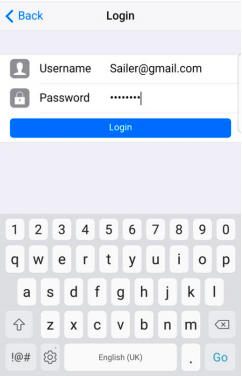
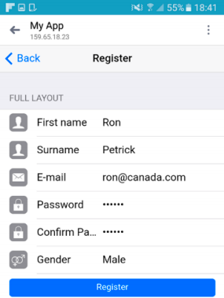
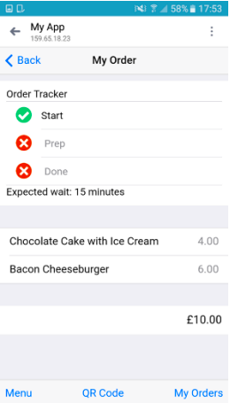
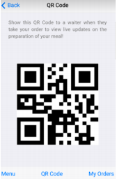
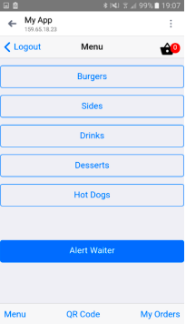
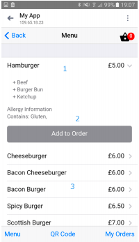

# Framework7 PhoneGap Application 

> [Framework7](http://www.idangero.us/framework7) is a Mobile UI framework that can be used to build hybrid apps with PhoneGap. This template allows you to get started using Framework7 
  quickly. 
  
  For a more extensive Framework7 sample, see the [one included in their Github project](https://github.com/nolimits4web/Framework7/tree/master/dist)
  or the [demo apps on their website](http://www.idangero.us/framework7/apps/#.VpQCc5MrKjQ).
    
  Also, for an intro to Framework7, check out [this post on the PhoneGap blog](http://phonegap.com/blog/2015/11/30/framework7/).   
  
### Authors

this application was created by

* Dominic Calina
* Duncan Fraser
* Jason Broomfield
* Lachlan Woods  
* Mark Gordon 
* Mohammed Abbasi 

## Usage
    
### PhoneGap CLI

    $ phonegap create my-app --template phonegap-template-framework7

### Cordova CLI

    $ cordova create my-app --template phonegap-template-framework7
    
### Desktop

In your browser, open the file:

    /www/index.html

# My Contributions

This project was a group effort. I was reponsible for only the customer application that is stored in this repo. The kitchen was designed and developed by Jason Broomfield, the waiter application was designed and developed by Lachlan Loods.

## Account Creation

	
I was responsible for creating the customer side of the expierence, this included allowing the customer to register and account. This meant passing values to php scits that would in turn regotser accounts and also log them in. The account was an easy way to tie orders to certain customers.
	
	
## Order Tracking

	
I created a simple tracker that would get the status of the order from the kitchen. There was a different sapp created for the kitchen that would update the order status in a database that the customer app could then read from.
	
## QR Code

The QR code was used to allow waiter to take orders from the customer. A customer orders their food then allerts a waiter. The waiter scans the qr code and puts the customers order through. they can then charge the customer.

## Menu Display

The customer adds items to their order using this menu. the items can be viewed the the customers basket. They can then alert a waiter when they are ready to order.